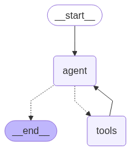

# 1-basic-local-rag

[](https://colab.research.google.com/github/Esturban/agent/blob/master/examples/1-basic-local-rag/basic_local_rag_workbook.ipynb)

Minimal RAG: fetch web documents at runtime, split and embed into a local ChromaDB, answer questions via a single-node LangGraph.

**Keys:** `OPENAI_API_KEY`
**Files:** none — documents are fetched from the web at runtime

```bash
python examples/1-basic-local-rag/main.py
```



---

### How it works

- `src/tools.py` — loads web documents, splits into chunks, builds a ChromaDB collection
- `src/workflow.py` — `retrieve → generate` graph
- `main.py` — entry point

### Notes

- Every run re-loads and re-embeds documents (no persistence between runs)
- No conversation memory — each query is independent
