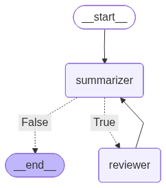

# 5-react-agent-lg

## Prerequisites
**Keys:** `OPENAI_API_KEY`
**Files:** `data/product/EcoSprint_Specification_Document.pdf`
**Colab:** ⚠️ upload the PDF to your Colab session before running

LangGraph ReAct agent with a two-node critique loop: a **Summarizer** drafts a PDF summary, a **Reviewer** grades it and suggests improvements, and the loop continues until the reviewer approves. Demonstrates multi-turn agent reasoning with `MemorySaver` checkpointing.



```bash
python examples/5-react-agent-lg/main.py
```
